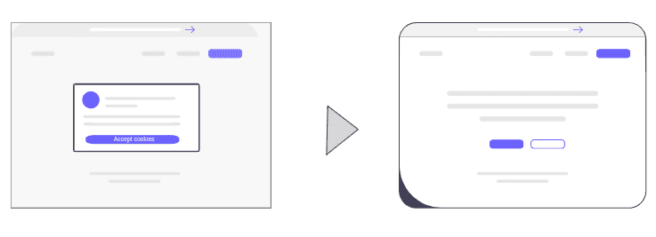

# WebShotApi.com API client for PHP

Capture screenshots and save images in various formats such as JPG, PNG, and PDF effortlessly. Additionally, leverage the capability to extract selectors for every HTML element, complete with coordinates and CSS styles post-browser rendering. 
Use our Unique AI algorithm to remove cookies banner before take a screenshot.

# Installation

```bash
composer require webshotapi/client
```

# Remove cookies popup before take sceenshot


Utilize an innovative AI algorithm to seamlessly eliminate the obstructive cookies popup before capturing a screenshot.
[Read more](http://webshotapi.com/blog/remove-cookies-before-take-screenshot/)

# Docs
Full documentation about our api you can find in this website [Website screenshot API DOCS](https://webshotapi.com/docs/)


## API KEY
Api key you can generate after register.
[https://dashboard.webshotapi.com/api_keys](https://dashboard.webshotapi.com/api_keys)

## Usage

### Take screenshot and save jpg to file
```php
<?php

include_once __DIR__ . '/../vendor/autoload.php';

use Webshotapi\Client\WebshotApiClient;
use Webshotapi\Client\Exceptions\WebshotApiClientException;

try{

    $API_KEY = 'YOU_API_KEY';
    $URL = 'PUT_LINK_TO_WEBSITE_HERE';
    
    $SAVE_PATH = '/tmp/save2.jpg';
    
    $params = array(
        'url' => $URL,
        'remove_modals' => true, // Remove cookies popups before take screenshot
        //'image_type' => 'webp', // To generate webp image 
        //'image_type' => 'pdf', // To generate pdf file 
        'premium_proxy' => false, // use premium proxy 
        'geotargeting' => 'us', // use ip from USA
        'block_ads' => '1', // Remove ads
        'viewport_width' => '1280',
        'viewport_height' => '2040',
        'image_quality' => 75,
        'transparent_background' => false,
        'full_page' => true,
    );
    
    $webshotapi = new WebshotApiClient($API_KEY);
    
    //Download, save jpg and send to browser
    $response = $webshotapi->screenshot($params);
    $response->save($SAVE_PATH);

} catch (WebshotApiClientException $e){
    echo"ERROR: ";
    echo $e->getMessage();
}
```

### Record scrolling video and save to mp4 file
You can convert your html page to scrolling movie

Example gif:
[](https://github.com/webshotapi/php-client/blob/main/images/stripe-video.gif?raw=true)

Link to example mp4: https://github.com/webshotapi/php-client/raw/c77cb5a3d84b58a2dfd92ba30ed6850f83d7a52e/images/stripe-video.mp4

```php
<?php

include_once __DIR__ . '/../vendor/autoload.php';

use Webshotapi\Client\WebshotApiClient;
use Webshotapi\Client\Exceptions\WebshotApiClientException;

try{
    
    $API_KEY = 'YOU_API_KEY';
    $URL = 'PUT_LINK_TO_WEBSITE_HERE';
    
    $SAVE_PATH = '/tmp/save2.pdf';
    
    $params = array(
        'url' => $URL,
        'viewport_width' => '1920',
        'scrolling_enable' => true,
        'viewport_height' => '1080',
    );
    
    $webshotapi = new WebshotApiClient($API_KEY);
    
    //Download, save jpg and send to browser
    $response = $webshotapi->videoJson($params);
    $response->save($SAVE_PATH);
    

} catch (WebshotApiClientException $e){
    echo"ERROR: ";
    echo $e->getMessage();
}
```

### Take screenshot and save PDF to file
You can covert your html page to invoice in PDF.
```php
<?php

include_once __DIR__ . '/../vendor/autoload.php';

use Webshotapi\Client\WebshotApiClient;
use Webshotapi\Client\Exceptions\WebshotApiClientException;

try{
    
    $API_KEY = 'YOU_API_KEY';
    $URL = 'PUT_LINK_TO_WEBSITE_HERE';
    
    $SAVE_PATH = '/tmp/save2.pdf';
    
    $params = array(
        'url' => $URL,
        'viewport_width' => '1280',
        'viewport_height' => '2040',
  
    );
    
    $webshotapi = new WebshotApiClient($API_KEY);
    
    //Download, save jpg and send to browser
    $response = $webshotapi->pdf($params);
    $response->save($SAVE_PATH);
    

} catch (WebshotApiClientException $e){
    echo"ERROR: ";
    echo $e->getMessage();
}
```

### Extract words map and HTML elements with css styles after rendering
Unique software to extract all selectors for HTML elements from website with css styles after browser rendering. Additionally, you can extract all words with position (x,y,width, height, offset from previous word). Thank that you can build words map of website.

#### Sample script:
```php
<?php

include_once __DIR__ . '/../vendor/autoload.php';

use Webshotapi\Client\WebshotApiClient;
use Webshotapi\Client\Exceptions\WebshotApiClientException;

try{

$API_KEY = 'YOU_API_KEY';
$URL = 'PUT_LINK_TO_WEBSITE_HERE';

$SAVE_PATH = '/tmp/save2.json';

$params = array(
    [
        'url' => $URL,
        'extract_selectors' => true,
        'extract_words' => true,
        'extract_style' => 1,//0 - skip styles, 1 - download most import css styles, 2 - download all styles for element
    ]
);

$webshotapi = new WebshotApiClient($API_KEY);

//Download, save jpg and send to browser
$response = $webshotapi->extract($params);

// Save to file
$response->save($SAVE_PATH);

// If you want to manipulate json f
$json_data = $response->json();


} catch (WebshotApiClientException $e){
echo"ERROR: ";
echo $e->getMessage();
}
```
#### Example result json for extract method

```json
{
  "status_code": 200,
  "html": "<!doctype html><html lang='en' dir='ltr'><head><base hr...",
  "text": "Welcome in our page\\nToday is Monday..",
  "selectors": [
    {
      "class": ".col-12 col-lg-12",
      "id": "price",
      "itemprop": "title",
      "x": 434.8,
      "y": 343.4,
      "w": 434,
      "h": 43,
      "xpath": "/html/body/div[1]/div[2]/div/div[2]/ul/li[5]/ul/li[2]",
      "style": {
        "visibility": "visible",
        "display": "block",
        "fontWeight": "400",
        "backgroundImage": "none",
        "cursor": "pointer",
        "fontSize": "22px",
        "color": "rgb(255, 255, 255)",
        "position": "absolute",
        "textDecoration": "none solid rgb(255, 255, 255)",
        "textDecorationLine": "none",
        "backgroundColor": "rgba(0, 255, 255, 0)"
      }
    }
  ],
  "words": [
    {
      "xpath": "/html/body/div[1]/div[2]/div/div[2]/ul/li[5]/a",
      "word": "Hello",
      "word_index": 2,
      "offset": 14,
      "position": {
        "x": 434.8,
        "y": 343.4,
        "w": 434,
        "h": 43
      }
    }
  ]
}


```

## API docs
Full documentation about our api you can find in this website http://webshotapi.com/docs/
For php client docs: [API DOCS](https://webshotapi.com/docs/sdk/php)

## License
[MIT](https://choosealicense.com/licenses/mit/)